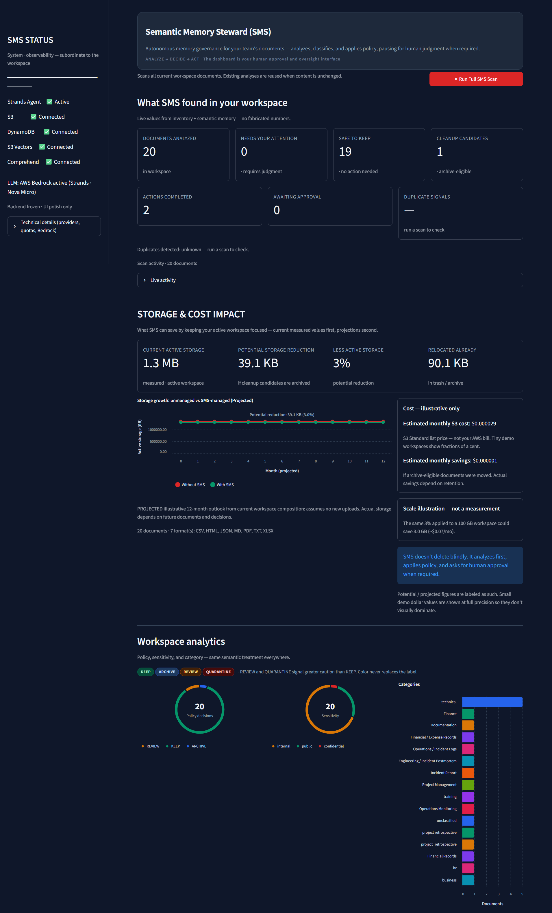

# Semantic Memory Steward (SMS)

> **AWS Hackathon Submission** — Built with the [Strands Agents SDK](https://strandsagents.com/)

Semantic Memory Steward is a **data-governance agent** that turns passive S3 storage into an active, governed semantic memory system. It reads documents, understands what they **mean** (not just what they're named), enriches each classification with real AWS signals, detects duplicates and related content, scores importance, and applies a **deterministic safety policy** — acting autonomously only on low-risk decisions and halting for human approval whenever risk rises.

The key design principle: **the AI understands; the deterministic policy engine decides.** A model can recommend, but it can never override governance rules.

---

## The Problem

As an S3 bucket grows, it becomes a triage nightmare:

- **Stale material** — old projects, retired docs, superseded records — sits alongside active assets.
- **Duplicates** — exact copies and near-copies — silently inflate storage and confuse ownership.
- **Sensitive content** — employee data, financial figures — mixes into the same namespace with no flagging.
- **Important records** — runbooks, contracts, reviews — are undistinguished from noise.

Traditional storage tools answer *"what is this file called?"* — SMS answers *"what is this file, and what should happen to it?"*.

---

## The Solution

```
scan → understand → enrich → relate → score → govern → approve → act → remember
```

1. **Scan** the bucket with S3 Inventory.
2. **Read** each object's content (type-aware, safely truncated).
3. **Understand** it semantically via a Strands-orchestrated LLM (Amazon Bedrock, Nova Micro).
4. **Enrich** it with Amazon Comprehend entity and PII signals.
5. **Relate** it — exact duplicates by hash/ETag, semantic siblings by vector similarity.
6. **Score** its importance with a deterministic formula.
7. **Govern** it through a deterministic PolicyEngine → `KEEP`, `ARCHIVE`, `REVIEW`, or `QUARANTINE`.
8. **Approve** — `REVIEW` halts autonomy; a human confirms via the dashboard.
9. **Act** — the ActionEngine safely executes copy → verify → delete when authorized.
10. **Remember** — the result is persisted to DynamoDB and S3 Vectors so rescans are cheap and cached.

---

## Dashboard



The dashboard is the human-facing workspace: it runs full scans, inspects per-document semantic analysis with Comprehend evidence, surfaces the human-approval queue whenever autonomy would halt, tracks live activity, and reports projected storage impact.

---

## Why This Is an Agent

SMS is agentic in a concrete, verifiable way — not merely because an LLM is present:

- **Agent orchestration** — a Strands `SMSAgent` runs the analysis loop with structured-output enforcement.
- **Semantic reasoning** — the model classifies category, sensitivity, importance, and confidence against a strict Pydantic schema.
- **Tool/service interaction** — the agent drives real AWS services (S3, Comprehend, DynamoDB, S3 Vectors) through purpose-built adapters.
- **Persistent semantic memory** — results and embeddings are stored and *reused* (idempotent rescans, no re-paying for repeated classification).
- **Autonomous low-risk actions** — `ARCHIVE` of low-risk content executes without a human in the loop.
- **Human escalation for risky actions** — `REVIEW` and destructive flows stop dead and wait for explicit approval.

The LLM is a component of the loop, not the loop itself. Governance, orchestration, memory, and action execution are all deterministic and inspectable.

---

## Architecture


See [`docs/architecture.md`](docs/architecture.md) for the full Mermaid source and data-flow walkthrough.

The architecture separates concerns into five layers:

- **Semantic reasoning** — Strands agent layer (LLM + Comprehend enrichment).
- **Deterministic governance** — importance scoring, relationship detection, and the PolicyEngine.
- **Persistent semantic memory** — DynamoDB metadata + S3 Vectors cosine index.
- **Human approval boundary** — autonomy halts here for review decisions.
- **Action execution** — authorization + verified copy → verify → delete mutations.

### AWS / AI Components

| Component | Technology | Role | Status |
|-----------|-----------|------|--------|
| Model provider | Amazon Bedrock (`amazon.nova-micro-v1:0`) via Strands | Semantic classification | **Live — default** |
| Agent runtime | Strands Agents SDK (`strands-agents>=1.54.0`) | Agent loop + structured output | **Live** |
| AgentCore Harness | Optional `bedrock-agentcore` harness | Managed agent-loop integration, same Strands classification | **Optional, verified smoke test** (`docs/agentcore.md`) |
| Inventory | Amazon S3 (`S3 Inventory`) | List objects + metadata | **Live** |
| Content reader | Amazon S3 | Type-aware text extraction (PDF, XLSX, HTML, text) | **Live** |
| Entity/PII enrichment | Amazon Comprehend | `detect_entities` + `detect_pii_entities` | **Live** |
| Semantic memory | Amazon DynamoDB | Per-document classification record | **Live** |
| Vector memory | Amazon S3 Vectors | 1024-dim cosine index, Titan V2 embeddings | **Live** |
| Action safety | `ActionAuthorizer` + `ActionEngine` | Approval boundary + verified S3 mutations | **Live** |
| Infrastructure | AWS SAM / CloudFormation | DynamoDB table + S3 Vectors index | **Live** |
| External providers | Gemini / Groq / Mistral / NVIDIA (by explicit choice) | Alternate LLM backends | **Optional** |

> Bedrock Nova Micro is the current default provider and `bedrock` is the default `SMS_LLM_PROVIDER`. The AgentCore harness is an **available** integration — it is not implied on every execution. External providers remain selectable through configuration, and the active provider is disclosed in the dashboard System Panel.

---

## Core Workflow

1. **Scan** — S3 Inventory lists candidate objects.
2. **Read** — the content reader fetches and decodes each object (100 KB cap by default).
3. **Idempotency gate** — content hash + ETag checked against DynamoDB; unchanged documents reuse cached analysis.
4. **Semantic analysis** — the Strands agent classifies category, sensitivity, importance, and confidence into a validated `SemanticAnalysisResult`.
5. **Comprehend enrichment** — entity and PII detection run in parallel and are annotated on the document (PERSON entities are separate from PII detection).
6. **Relationship detection** — exact duplicates via content hash, then semantic siblings via vector cosine search.
7. **Importance scoring** — deterministic weighted formula (recency, relevance, sensitivity, importance, duplicate penalty).
8. **Policy evaluation** — the deterministic PolicyEngine returns `KEEP` / `ARCHIVE` / `REVIEW` / `QUARANTINE` with explicit reasons.
9. **Human approval** — `REVIEW` halts; the dashboard requires an explicit decision before any mutation.
10. **Action execution** — authorized mutations run as copy → verify → delete, with source/destination verification at each step.

---

## Safety & Human Oversight

| Policy | Meaning | Autonomy |
|--------|---------|----------|
| **KEEP** | Retain in place, no mutation | Yes (no-op) |
| **ARCHIVE** | Move to `archive/` prefix | Yes *for low-risk content only* |
| **REVIEW** | Surface for human judgment | **Autonomy halts** |
| **QUARANTINE** | Move to `trash/` prefix | **Always requires explicit human approval** |

Safety invariants, enforced in code and covered by the test suite:

- The **ActionAuthorizer** is an independent gate: `DELETE` is blocked outright; mutating actions need approval or an authorized low-risk path (`LOW` risk for ARCHIVE).
- **`REVIEW` can never execute autonomously** — the UI presents the analysis + Comprehend evidence and explicitly demands a decision.
- **All mutations are copy → verify → delete** — the destination is verified to exist before the source is removed, and the source state is verified after.
- The **PolicyEngine is deterministic and authoritative** — a hallucinated LLM recommendation cannot override it. The model supplies understanding; the engine supplies the decision.

---

## Semantic Memory & Idempotency

- Content is identified by **SHA-256 content hash**, with ETag + size as supporting signals.
- Unchanged content reuses the **cached analysis** and **cached embedding** — rescans do not re-pay the LLM or the embedding provider.
- If the embedding model changes but content doesn't, the cached analysis is reused and the vector is **re-embedded**.
- Each decision is persisted to **DynamoDB** (`sms-semantic-memory`) and embeddings to **S3 Vectors** (1024-dim Titan V2).
- **Relationship detection** finds exact duplicates (hash), then semantically related documents (cosine similarity), surfacing `DUPLICATE_CONFIRMED`, `DUPLICATE_CANDIDATE`, and `RELATED` — duplicates go to `REVIEW`, never auto-deleted.

---

## Economic ESTIMATE

SMS includes a small, deterministic **economic assessment** module (`src/sms_agent/economics.py`) that estimates whether a governance decision is *economically worthwhile* to chase — e.g. whether the storage saving from an `ARCHIVE` justifies the processing cost (illustrative S3 Standard pricing).

It is strictly **informational and additive**:

- It is **never a gate** — it cannot block, authorize, or change any policy decision.
- It **never overrides** `recommended_action` or the ActionEngine.
- It **never bypasses** the human approval boundary.

It is layered on top of the existing safety path purely as a readability aid.

---

## Project Structure

```
SMS/
├── app.py                    # Streamlit dashboard (run this for the demo)
├── template.yaml             # AWS SAM infrastructure (DynamoDB + S3 Vectors)
├── pyproject.toml            # Project metadata and dependencies
├── .env.example              # Environment variable template
├── src/sms_agent/
│   ├── agent.py              # SMSAgent — Strands wrapper, structured output enforcement
│   ├── pipeline.py           # SMSPipeline — full orchestration with idempotency
│   ├── comprehend.py         # Amazon Comprehend enrichment (PERSON ≠ PII)
│   ├── policy.py             # Deterministic PolicyEngine
│   ├── actions.py            # ActionEngine with copy-verify-delete safety
│   ├── authorization.py      # ActionAuthorizer — approval boundary
│   ├── importance.py         # Deterministic importance scoring
│   ├── relationships.py      # Hash/ETag + semantic vector relationship detection
│   ├── memory.py             # DynamoDB + S3 Vectors persistence
│   ├── economics.py          # Economic ESTIMATE (informational, additive, never a gate)
│   ├── embeddings.py         # Embedding providers (Bedrock Titan V2 default, Gemini option)
│   ├── s3_inventory.py       # S3 object inventory
│   ├── s3_content.py         # S3 content reader (PDF/XLSX/HTML/text)
│   ├── impact.py             # Storage & cost impact projection (honest, labeled "projected")
│   ├── trace.py              # Activity/event tracing for the UI
│   └── models.py             # Pydantic domain models
├── tests/                    # 383 hermetic tests, all passing
├── evaluation/               # Offline governance evaluation harness (5 cases)
├── docs/
│   ├── architecture.md       # Architecture diagram (Mermaid) + data flow
│   ├── agentcore.md          # AgentCore harness integration record
│   └── demo-scenario.md      # Demo narrative
└── scripts/
    ├── seed_demo_workspace.py  # Deterministic 20-document demo corpus
    └── experiments/            # Historical AWS investigation scripts (not production)
```

---

## Setup

### Prerequisites

- Python 3.9+
- AWS credentials with access to **S3, DynamoDB, Amazon Comprehend, Amazon Bedrock, and S3 Vectors**
- An S3 bucket with documents to analyze (see [Demo](#demo))
- Provisioned infrastructure: DynamoDB table `sms-semantic-memory` + S3 Vectors bucket/index (see [Infrastructure](#infrastructure))

### Installation

```bash
# 1. Clone and set up a virtual environment
python -m venv .venv
.venv\Scripts\activate          # Windows
# source .venv/bin/activate     # Linux/macOS

# 2. Install the package with dev dependencies (includes Streamlit)
pip install -e ".[dev]"

# 3. Configure environment
copy .env.example .env
# Edit .env with your bucket, table, vectors, and profile
```

### Environment Variables (`.env`)

```bash
# AWS
AWS_PROFILE=your-profile
AWS_DEFAULT_REGION=us-east-1

# S3 observation layer
SMS_S3_BUCKET=your-bucket-name

# Semantic memory
SMS_DYNAMO_TABLE=sms-semantic-memory
SMS_VECTOR_BUCKET=your-vectors-bucket
SMS_VECTOR_INDEX=sms-embeddings
SMS_VECTOR_DIMENSION=1024

# LLM provider (bedrock is the default)
SMS_LLM_PROVIDER=bedrock
SMS_BEDROCK_MODEL_ID=amazon.nova-micro-v1:0

# Embeddings (Bedrock Titan V2 is the default)
SMS_EMBEDDING_PROVIDER=bedrock
SMS_BEDROCK_EMBEDDING_MODEL=amazon.titan-embed-text-v2:0

# Optional: AgentCore harness (see docs/agentcore.md)
# SMS_LLM_PROVIDER=agentcore
# SMS_AGENTCORE_HARNESS_ARN=arn:aws:bedrock-agentcore:us-east-1:<acct>:harness/<id>

# Optional: external/gemini embedding provider
# SMS_EMBEDDING_PROVIDER=gemini
# GEMINI_API_KEY=your-key-here
```

---

## Running the Dashboard

```bash
aws login --profile your-profile    # or otherwise authenticate with AWS
streamlit run app.py
```

The dashboard opens at `http://localhost:8501`.

API / CLI execution is also available via `python -m sms_agent`; the dashboard is the primary interface.

---

## Testing

```bash
pytest
```

The repository ships **383 hermetic tests** covering: pipeline idempotency, policy invariants, relationship/duplicate detection, authorization boundaries, Comprehend enrichment logic, DynamoDB + S3 Vectors persistence, action-engine copy-verify-delete safety, the human-approval boundary, the economic ESTIMATE module, Strands/Bedrock wiring, and the AgentCore adapter. No credentials or live AWS calls are needed.

CI (`.github/workflows/ci.yml`) runs the full suite on **Python 3.12** for every push to `main` and every pull request.

---

## Evaluation

The offline evaluation harness verifies governance invariants without a live LLM:

```bash
cd evaluation
python runner.py
```

Five evaluation cases exercise the core policy decision paths (`KEEP`, `ARCHIVE`, `REVIEW`), asserting that `REVIEW` always requires human approval, that destructive actions are never autonomous for sensitive content, and that relationship detection behaves correctly. The `QUARANTINE` destructive path (with approval gate) is additionally covered by the main test suite.

---

## Demo

### Seed the corpus

A deterministic, multi-format demo workspace (~20 documents, ~1.3 MB) ships in `scripts/seed_demo_workspace.py`:

```bash
python scripts/seed_demo_workspace.py --bucket your-bucket-name   # upload the demo docs
python scripts/seed_demo_workspace.py --reset --bucket ...        # tear down exactly the seeded keys
```

The corpus mixes `.md`, `.pdf`, `.json`, `.csv`, `.xlsx`, `.html`, and `.txt` documents with varied content age and category, and deliberately includes an **exact-duplicate pair** and a **near-duplicate (semantically related) pair** so the relationship detector has real material to surface.

### Judge-oriented walkthrough

1. **Seed** the demo corpus, then `streamlit run app.py`.
2. **Run a full scan** — watch every document flow through the pipeline with live activity tracing.
3. **Open the Document Inspector** — inspect the semantic analysis, Comprehend entity/PII evidence, importance score, and relationship findings for a specific file.
4. **Watch deterministic governance** — sensitive and high-risk documents land in `REVIEW`; the UI visibly halts autonomy with a red "Human Approval Required" boundary.
5. **Find the duplicate pair** — the detector flags the identical and near-identical documents for review rather than deleting anything.
6. **Approve a `QUARANTINE`** — observe the verified copy → verify → delete sequence relocates the object under the `trash/` prefix.
7. **Rescan** — unchanged documents hit the idempotency cache: analysis is reused, no LLM re-invocation, no re-embedding.
8. **Review storage impact** — the dashboard reports the projected (labeled `projected`) storage effect of the decisions.

---

## Limitations / Scope

Honest scope, as of this submission:

- **Content size cap** — objects above 100 KB (configurable via `SMS_MAX_CONTENT_BYTES`) are skipped with a clear reason; no chunked long-document processing yet.
- **Supported formats** — `.txt`, `.md`, `.csv`, `.json`, `.html`, `.pdf` (pypdf), and `.xlsx` (openpyxl). Scan-readable; scanned images and unstructured rich formats are not yet supported.
- **Embedding preprocessing** — text is normalized and truncated within the content cap; documents that need chunked embedding (very long or multi-section) are a hardening item.
- **Deployment** — targets a single-account `us-east-1` setup with SAM-provisioned DynamoDB + S3 Vectors; multi-region, organizations, and high-scale production hardening are outside MVP scope.
- **Live provider availability** — Bedrock Nova Micro and Titan V2 embeddings are the default; availability depends on your account's region quotas.

---

## License

[MIT](LICENSE)