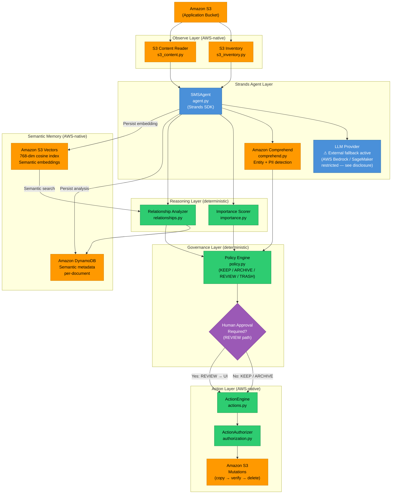

# SMS Architecture

## System Overview

Semantic Memory Steward (SMS) is a data-governance agent that autonomously scans an S3 bucket, semantically classifies each document, applies a deterministic safety policy, and either acts autonomously or pauses for human approval — depending on the risk level.

The architecture deliberately separates:

- **AWS-native deterministic layers** (S3, Comprehend, DynamoDB, S3 Vectors, ActionEngine)
- **Semantic analysis layer** (Strands Agent wrapping an LLM provider)
- **Human approval boundary** (enforced before any irreversible action)

---

## Current Architecture (Mermaid)

---

## Legend

| Colour | Meaning |
|--------|---------|
| 🟠 Orange | **AWS-native** — verified live against the AWS account |
| 🔵 Blue | **Strands Agent** — model-provider abstraction layer |
| 🟢 Green | **Deterministic** — no LLM involved; logic is fully auditable |
| 🟣 Purple | **Human approval boundary** — autonomy halts here for REVIEW decisions |

---

## LLM Provider Disclosure

> **Important:** SMS's architecture routes semantic analysis through Strands, which supports AWS Bedrock and SageMaker as native model providers. During this submission, the AWS account has two active restrictions:
>
> - **Amazon Bedrock**: `ValidationException: Operation not allowed` at the account level.
> - **Amazon SageMaker**: Service Quota of **0 instances** for all GPU endpoint families (`ml.g5`, `ml.g4dn`, `ml.g6`, `ml.p3`, `ml.p4`) in `us-east-1`.
>
> As a result, semantic analysis currently uses an **external LLM fallback**, clearly disclosed in both the dashboard System Status panel and this document. The governance, Comprehend enrichment, DynamoDB persistence, S3 Vectors semantic memory, and ActionEngine layers are fully AWS-native and verified live.

---

## Data Flow Summary

1. **Scan**: S3 Inventory lists all objects and their metadata.
2. **Read**: S3 Content Reader fetches text content (max 100 KB, type-safe).
3. **Idempotency gate**: Content hash + ETag checked against DynamoDB; cached analyses are reused.
4. **Semantic analysis**: Strands Agent calls the LLM provider → returns structured `SemanticAnalysisResult` (category, sensitivity, importance_score, reasoning).
5. **Comprehend enrichment**: `detect_entities` and `detect_pii_entities` run in parallel. PERSON entities are annotated separately from PII detection — they do not imply each other.
6. **Relationship analysis**: Exact hash/ETag matching first; then S3 Vectors cosine similarity search for semantic siblings.
7. **Importance scoring**: Deterministic weighted formula (recency, sensitivity, relevance, duplicate penalty).
8. **Policy evaluation**: Deterministic rule matrix → `KEEP`, `ARCHIVE`, `REVIEW`, or `TRASH`.
9. **Human approval boundary**: `REVIEW` decisions halt. A human operator must select an action and explicitly confirm via the dashboard before execution proceeds.
10. **Action execution**: `ActionEngine` validates authorization, then executes (copy-then-verify-then-delete for QUARANTINE; no-op for KEEP).
11. **Persistence**: `SemanticMemoryRecord` written to DynamoDB; embedding written to S3 Vectors.
